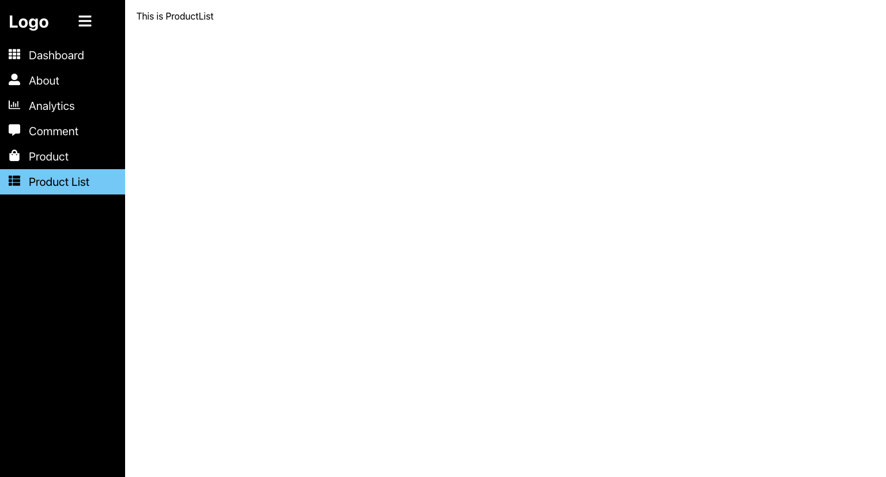

# React Sidebar

This project was bootstrapped with [Create React App](https://github.com/facebook/create-react-app).

## Quick Start

In the project directory, you can run:

### `npm install`

### `npm start`

## Related used library

- 'react-router-dom'
- 'react-icons'

## UI

CSS transition, toggle, sidebar

